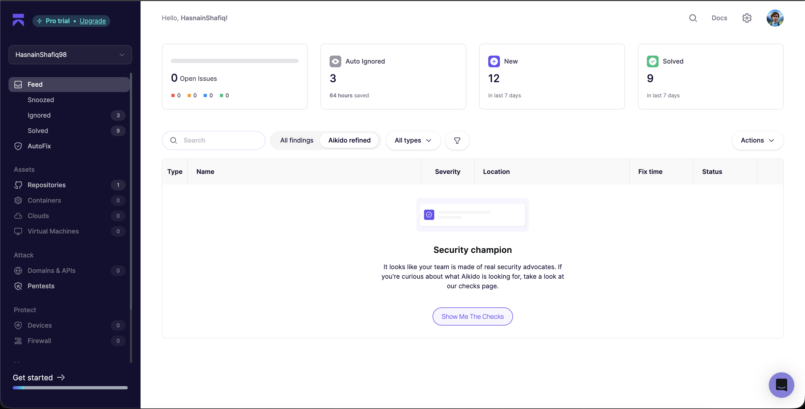

# ContextOS

ContextOS is an enterprise memory layer that ingests mixed business data into atomic facts, links each fact to provenance, detects conflicts, and exposes retrieval APIs for AI agents and human review workflows.

## What You Get

- FastAPI backend for ingestion, sync, conflict resolution, retrieval, provenance, and metrics.
- React frontend for dashboarding, ingest operations, fact browsing, conflict triage, and graph exploration.
- Persistent state (JSON by default, SQLite optional).
- Sample enterprise dataset in `data/Dataset`.

## Tooling Used

- Entire CLI for AI session checkpointing and rewindable build/debug history.
- Aikido for security posture monitoring and issue triage during development.

### Aikido Dashboard



## Repository Layout

- `apps/api` - FastAPI service and tests.
- `apps/front-end` - React + Vite UI.
- `data` - raw dataset and persisted state.
- `docs` - API contract, runbook, demo script, and implementation notes.
- `scripts` - helper scripts for ingest bootstrapping.

## Prerequisites

- Python `3.10+`
- Node.js `18+` (Node `20+` recommended)
- `npm`
- `make` (optional, for shortcuts)

## Quick Start

### 1. Start the API

```bash
cd apps/api
python3 -m venv .venv
source .venv/bin/activate
pip install -r requirements.txt
uvicorn contextos.api.main:app --reload --port 8000
```

API docs will be available at `http://localhost:8000/docs`.

### 2. Ingest the bundled dataset

From the repository root in a second terminal:

```bash
make dataset-ingest
```

Default ingest behavior is demo-friendly sampling (`sample_records_per_file=45`, `sample_seed=42`).

For full ingest without sampling:

```bash
make dataset-ingest-full
```

### 3. Start the frontend (optional but recommended)

```bash
cd apps/front-end
npm install
npm run dev
```

Frontend runs at `http://localhost:5173` and targets `http://localhost:8000` by default.

If needed:

```bash
export VITE_API_BASE_URL=http://localhost:8000
```

## Common Commands

### Backend

```bash
# From repo root
make api-install
make api-run
make api-test
```

### Dataset helpers

```bash
# Uses POST /ingest/dataset with sampling
make dataset-ingest

# Uses POST /ingest/dataset with sample_records_per_file=null
make dataset-ingest-full

# Simple synthetic conflict bootstrap
./scripts/bootstrap_sample_data.sh
```

### Frontend

```bash
cd apps/front-end
npm run dev
npm run build
npm run lint
npm run format
```

## Environment Variables

### Backend

- `CONTEXTOS_API_KEY` - when set, protected endpoints require `X-Api-Key`.
- `CONTEXTOS_STORAGE_BACKEND` - `json` (default) or `sqlite`.
- `CONTEXTOS_STATE_FILE` - optional custom path for state file.

Default state locations:

- JSON backend: `data/processed/contextos_state.json`
- SQLite backend: `data/processed/contextos_state.sqlite`

### Frontend

- `VITE_API_BASE_URL` - API base URL (default: `http://localhost:8000`).

## Protected Endpoints (when API key is enabled)

If `CONTEXTOS_API_KEY` is set, these require header `X-Api-Key: <key>`:

- `POST /ingest/upload`
- `GET /facts/{fact_id}/neighbors`
- `GET /graph/stats`

All other endpoints remain open in the current MVP.

## API Overview

- Health: `GET /health`
- Ingestion: `POST /ingest`, `POST /ingest/dataset`, `POST /ingest/upload`
- Sync: `POST /sync/dataset`
- Facts: `GET /facts`, `GET /facts/paged`, `GET /facts/{fact_id}`, `PATCH /facts/{fact_id}`
- Conflicts and rules: `GET /conflicts`, `POST /conflicts/{conflict_id}/resolve`, `GET/POST/DELETE /rules`
- Retrieval: `POST /query`
- Metrics: `GET /metrics/context-health`, `GET /metrics/ingestion-progress`
- Graph: `GET /facts/{fact_id}/neighbors`, `GET /graph/stats`

See `docs/api-contract.md` for request/response details.

## Testing

```bash
cd apps/api
source .venv/bin/activate
pytest -q
```

## Documentation Index

- `docs/runbook.md` - day-to-day developer operations.
- `docs/api-contract.md` - endpoint-level contract.
- `docs/demo-script.md` - judge/demo flow.
- `docs/lovable-handoff.md` - backend integration notes for UI work.
- `docs/implementation-plan.md` - current status and next milestones.
- `docs/entire-setup.md` - optional Entire CLI setup.

## Troubleshooting

- If ingest returns zero records, verify dataset path exists: `data/Dataset`.
- If graph endpoints return `401`, set `X-Api-Key` when `CONTEXTOS_API_KEY` is enabled.
- If frontend cannot reach backend, set `VITE_API_BASE_URL` explicitly and restart `npm run dev`.
- If state becomes invalid, check `/health` `state_integrity`; JSON backend auto-backs up corrupt state files.
